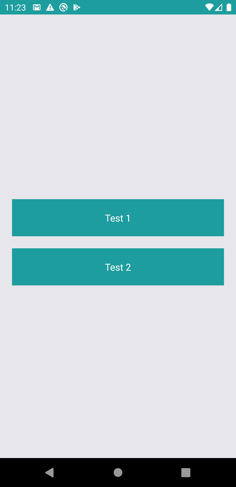
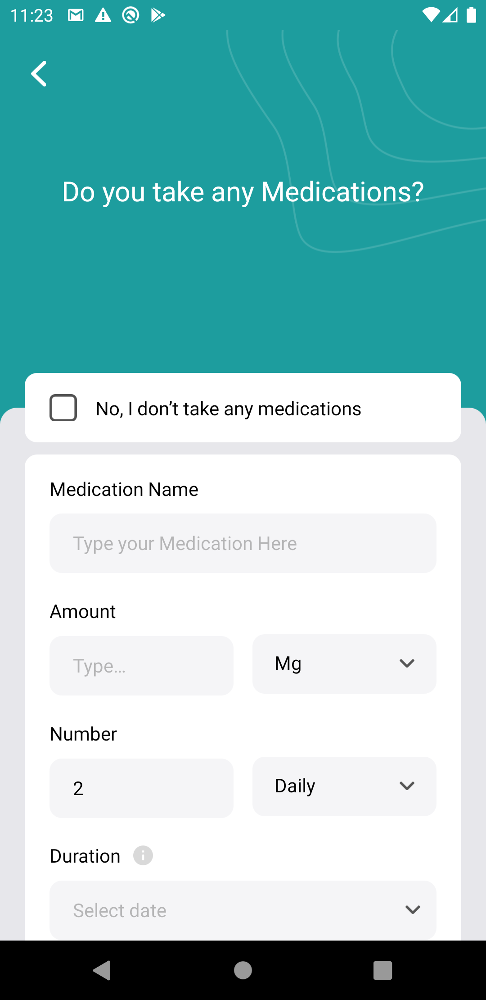
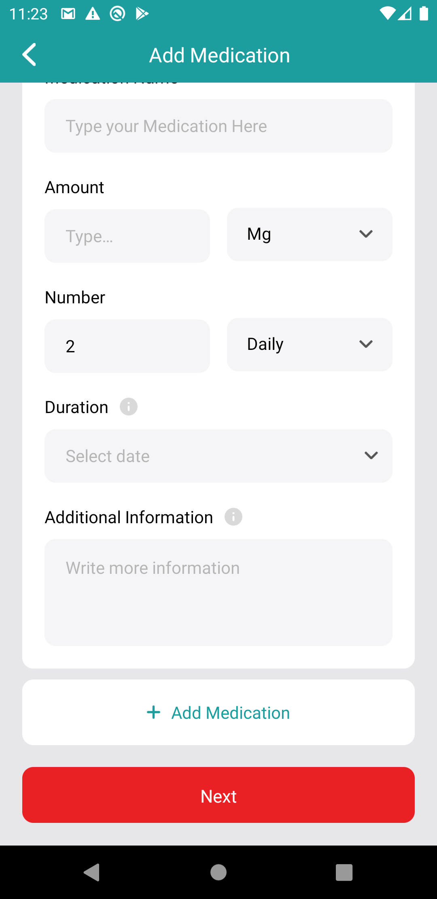
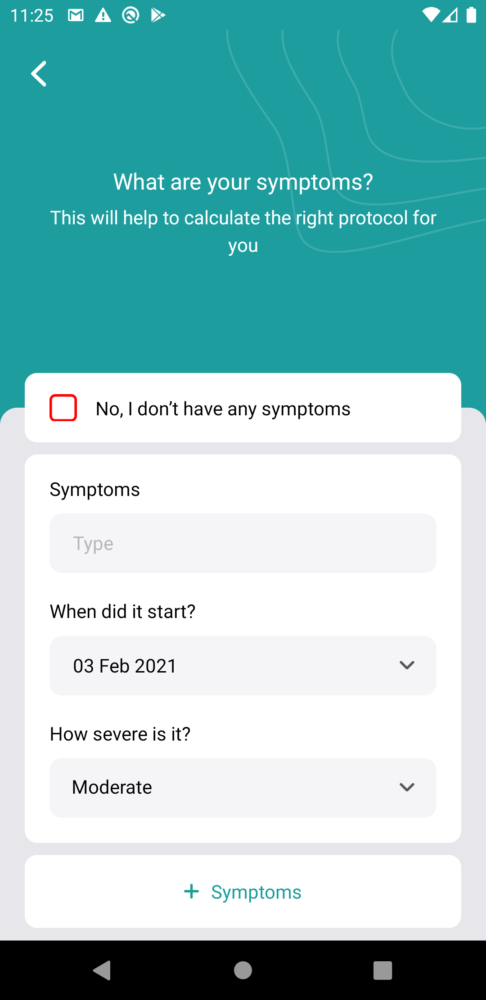
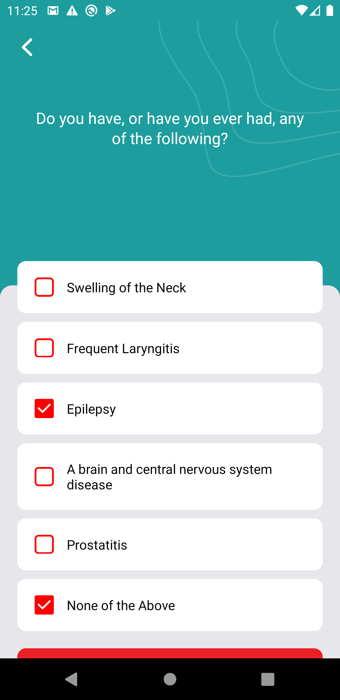
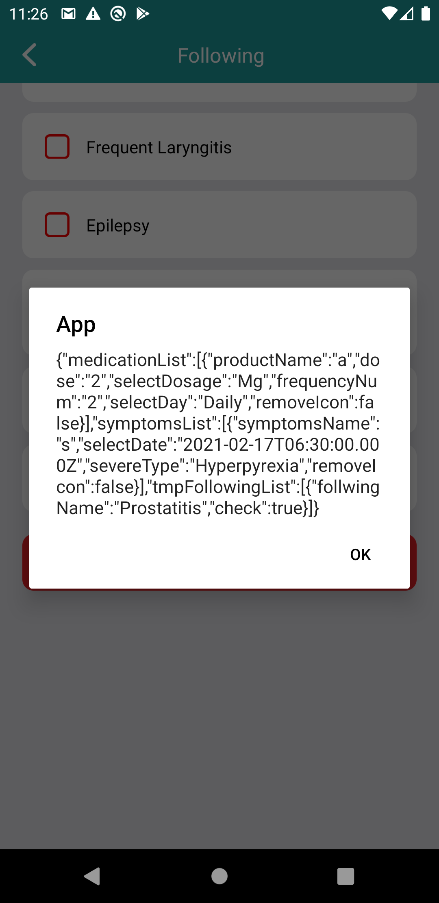

# MedicationAppSkillTest
Skill Test - Practical Test
 <hr />
 In this tutorial, we'll make a medication design and call dummy api using post method.
 <hr />
 
 * Android emulator image
 
 <div align="center">
    
                                         
    
    
                                         
    
</div>
      
<hr />                                                                                                
<h3><b>Running the project</b></h3>
<hr /> 

Assuming you have all the requirements installed, you can setup and run the project by running:

* yarn install to install the dependencies
* run the following steps for your platform

# Android

 ```
 yarn or npm install
 yarn or npm start
 npx react-native run-android
 ```
 
# IOS

```
 yarn or npm install
 cd ios
 pod install
 cd ..
 yarn or npm start
 npx react-native run-ios
```
